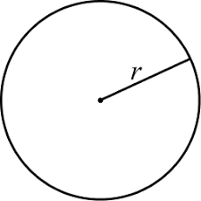

# TAD Círculo



O objetivo desta atividade é implementar um Tipo Abstrato de Dados chamado **Circle** (*Círculo* em inglês).
Um círculo pode ser matematicamente definido apenas em função do seu centro e do seu raio.
Portanto, uma abstração de um círculo necessita apenas destes dois dados.

## Requisitos
- Implemente em C++ um TAD chamado **Circle** (*Círculo* em inglês) usando Programação Orientada a Objetos.
- A classe `Circle` deve ter apenas dois *atributos*:
    - o raio
    - o centro (que deve ser um objeto da classe Ponto, que está em anexo a esta atividade)
- A classe `Circle` deve ter as seguintes *funções-membro*:
    - `Circle()` : o construtor *default* da classe
    - `Circle(Point& center, double radius)` : um construtor com dois argumentos
    - `Point getCenter()` : retorna o ponto no centro do círculo
    - `double getRadius(` : retorna o raio do círculo
    - `void setRadius(double radius)` : muda o valor do raio do círculo
    - `void setCenter(double x, double y)` : muda as coordenadas do centro do círculo
    - `void setCenter(Point& center)` : muda o centro do círculo
    - `double area()` : retorna a área do círculo
    - `bool interior(Point& p)` : determina se o Ponto p está ou não dentro do círculo
    - `std::string toString()` : retorna uma string contendo os valores do centro e raio

## Shell

```bash
#__case criando circulo com centro na origem e raio 8
$init circle 0 0 8
$show
Circle[radius: 8.000000, center: (0.000000,0.000000)]
$getradius
8
$getcenter
(0.000000,0.000000)
$setradius 5
$show
Circle[radius: 5.000000, center: (0.000000,0.000000)]
$end
```

```bash
#__case criando circulo e imprimindo área
$init circle 3 3 10
$show
Circle[radius: 10.000000, center: (3.000000,3.000000)]
$area
314.159
$end
```

```bash
#__case criando circulo e perguntando se ponto (3,4) está no interior
$init circle 3 3 10
$show
Circle[radius: 10.000000, center: (3.000000,3.000000)]
$pertence 3 4
true
$end
```

```bash
#__case mudando o centro do círculo
$init circle 3 3 10
$show
Circle[radius: 10.000000, center: (3.000000,3.000000)]
$setcenter 5 7
$show
Circle[radius: 10.000000, center: (5.000000,7.000000)]
$end
```


## Esqueleto

Acima desta atividade, você encontra uma pasta chamada **projeto** contendo um esqueleto da atividade. A pasta **projeto** contém três arquivos deste projeto: *main.cpp*, *Point.h* e *Circle.h* e mais dois arquivos auxiliares: *Makefile* e *Readme.txt*. Baixe todo esse projeto no seu computador. Não mexa no arquivo main.cpp pois ele já está pronto para uso. O único arquivo que você deve completar para finalizar esta atividade é o arquivo **Circle.h**.


