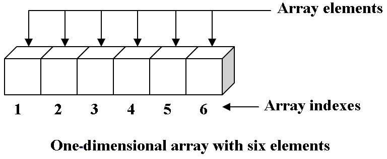

# Construa um vetor dinâmico I (procedural)



---

## Objetivo

- Implemente as seguintes funções do vetor dinâmico:
    - `Vector * vector_create(int capacity)`: cria um vetor de inteiros com alocação dinâmica.
    - `void vector_destroy(Vector * vector)`: libera memória que foi alocada para o vetor.
    - `void vector_add(Vector * vector, int value)`: adiciona um inteiro ao vetor.
    - `string vector_show(Vector * vector)`: exibe o conteúdo do vetor. 
- Ele deve ser iniciado utilizando alocação dinâmica e conter, além do vetor de dados, os atributos *size* e *capacity* que definem o tamanho atual e a capacidade do vetor.

---

## Shell
```bash
#__case create
$init 3
$status
size:0 capacity:3
$end

#__case add e tentar estourar
$init 5
$show
[ ]
$add 3 4 5 1
$show
[ 3 4 5 1 ]
$add 7 3 2 1
$show
[ 3 4 5 1 7 ]
$end

#__case init vazio
$show
[ ]
$end

#__case add
$init 10
$show
[ ]
$add 3 4 5 1
$show
[ 3 4 5 1 ]
$end

#__case add mais
$init 10
$show
[ ]
$add 3 4 5 1
$show
[ 3 4 5 1 ]
$add 7
$show
[ 3 4 5 1 7 ]
$end

#__case add mais
$init 5
$show
[ ]
$add 3 4 5 1
$show
[ 3 4 5 1 ]
$add 7
$show
[ 3 4 5 1 7 ]
$end
```

---

## Código Base

<!--FILTER main.cpp cpp-->
```cpp
#include <iostream>
#include <sstream>
using namespace std;

struct Vector {
    int capacity;
    int size;
    int * data;
};

Vector * vector_create(int capacity) {
    //crie o struct vector dinâmicamente
    //crie o vetor data
    //inicialize size e capacity
}

void vector_destroy(Vector * vector) {
    //destrua data
    //destrua a struct
}

void vector_add(Vector * vector, int value) {
    //utilize capacity e size para verificar se ainda existe espaço
}

//retorne a string no formato 
// [ a b c ]
string vector_show(Vector * vector) {
    //retorne uma string com os dados do vetor
    //você pode usar uma stringstream como buffer
    //stringstream ss;
    //ss << 5 << " eh inteiro";
    //ss.str() será "5 eh inteiro"
}


/* NAO MEXA DAQUI PRA BAIXO */
int main() {
    string line, cmd;
    int value;
    Vector * v = vector_create(0);
    while(true) {
        getline(cin, line);
        cout << "$" << line << endl;
        stringstream ss(line);
        ss >> cmd;
        if(cmd == "end"){
            break;
        } else if(cmd == "init") {
            ss >> value;
            if(v != nullptr)
                vector_destroy(v);
            v = vector_create(value);
        } else if(cmd == "status") {
            cout << "size:" << v->size << " capacity:" << v->capacity << "\n";
        } else if(cmd == "add") {
            while(ss >> value)
                vector_add(v, value);
        } else if(cmd == "show") {
            cout << vector_show(v) << endl;
        } else {
            cout << "fail: comando invalido\n";
        }
    }
    vector_destroy(v);
}
```
<!--FILTER_END-->


