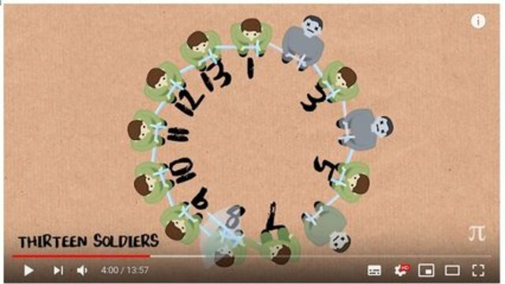

# Princesa - Implementação em vetor



---

Um problema bem interessante e antigo da matemática é conhecido como Josephus Problem. No link da imagem você pode, por curiosidades aprender bastantes sobre ele e o modelo matemático que se propõe a modelá-lo.

Nosso objetivo aqui será apenas implementar seu funcionamento.

--

No problema, **N** pessoas se colocam numa fila circular e assumem valores de 1 até **N**. Um número **E** é escolhido para iniciar o jogo. **E** pega a espada, mata o elemento à sua frente e passa a espada uma posição à frente. O jogo continua até que um único elemento permaneça vivo.

--

- Entrada
    - Os valores de **N** e **E** na primeira linha.
    - Etapa a etapa, os elementos que estão vivos na fila circular, indicando com um > quem está com a espada.

- Saída

---

## Implementação usando vetor

### Abordagem I

- marcando os elementos que morrem
    - crie um vetor auxiliar de bool
    - toda vez que alguém morrer, marque no vetor
    - procure pelo próximo elemento vivo

```c++
int elementos[size];
bool vivos[size];
//matar equivale a fazer
vivos[pos] = false;
//o próximo vivo seria uma busca pelo próximo vivo depois de pos
int prox = procurar_vivo(elementos, vivos, size, pos);
```

### Abordagem II

- retirando os elementos que morrem e diminuindo o tamanho do vetor.
    - reposicione os elementos “puxando” todos os que estiverem à frente

```c++
//faça a funcao matar que remove o elemento do vetor
//perceba que TUDO após *pos*, vai diminuir em 1
int elementos[size];
matar(elementos, size, pos);
size -= 1;
pos = pos % size; //se ele era o último agora é o zero
```

---

## Comparação

- Qual dos algoritmos você acha que é mais eficiente?
- Implemente os dois e vá aumentando a instância do problema e veja o resultado.

---

## Entradas e Saídas de amostra

```
>>>>>>>> 01
3 1
========
[ 1> 2 3 ]
[ 1 3> ]
[ 3> ]
<<<<<<<<

>>>>>>>> 02
3 2
========
[ 1 2> 3 ]
[ 1> 2 ]
[ 1> ]
<<<<<<<<

>>>>>>>> 03
3 3
========
[ 1 2 3> ]
[ 2> 3 ]
[ 2> ]
<<<<<<<<

>>>>>>>> 04
6 3
========
[ 1 2 3> 4 5 6 ]
[ 1 2 3 5> 6 ]
[ 1> 2 3 5 ]
[ 1 3> 5 ]
[ 1> 3 ]
[ 1> ]
<<<<<<<<

>>>>>>>> 05
9 9
========
[ 1 2 3 4 5 6 7 8 9> ]
[ 2> 3 4 5 6 7 8 9 ]
[ 2 4> 5 6 7 8 9 ]
[ 2 4 6> 7 8 9 ]
[ 2 4 6 8> 9 ]
[ 2> 4 6 8 ]
[ 2 6> 8 ]
[ 2> 6 ]
[ 2> ]
<<<<<<<<

>>>>>>>> 06
20 1
========
[ 1> 2 3 4 5 6 7 8 9 10 11 12 13 14 15 16 17 18 19 20 ]
[ 1 3> 4 5 6 7 8 9 10 11 12 13 14 15 16 17 18 19 20 ]
[ 1 3 5> 6 7 8 9 10 11 12 13 14 15 16 17 18 19 20 ]
[ 1 3 5 7> 8 9 10 11 12 13 14 15 16 17 18 19 20 ]
[ 1 3 5 7 9> 10 11 12 13 14 15 16 17 18 19 20 ]
[ 1 3 5 7 9 11> 12 13 14 15 16 17 18 19 20 ]
[ 1 3 5 7 9 11 13> 14 15 16 17 18 19 20 ]
[ 1 3 5 7 9 11 13 15> 16 17 18 19 20 ]
[ 1 3 5 7 9 11 13 15 17> 18 19 20 ]
[ 1 3 5 7 9 11 13 15 17 19> 20 ]
[ 1> 3 5 7 9 11 13 15 17 19 ]
[ 1 5> 7 9 11 13 15 17 19 ]
[ 1 5 9> 11 13 15 17 19 ]
[ 1 5 9 13> 15 17 19 ]
[ 1 5 9 13 17> 19 ]
[ 1> 5 9 13 17 ]
[ 1 9> 13 17 ]
[ 1 9 17> ]
[ 9> 17 ]
[ 9> ]
<<<<<<<<
```
